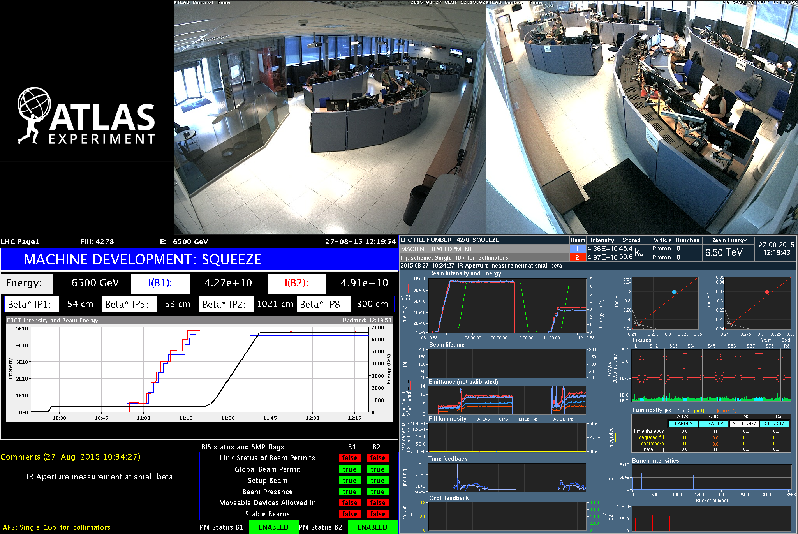
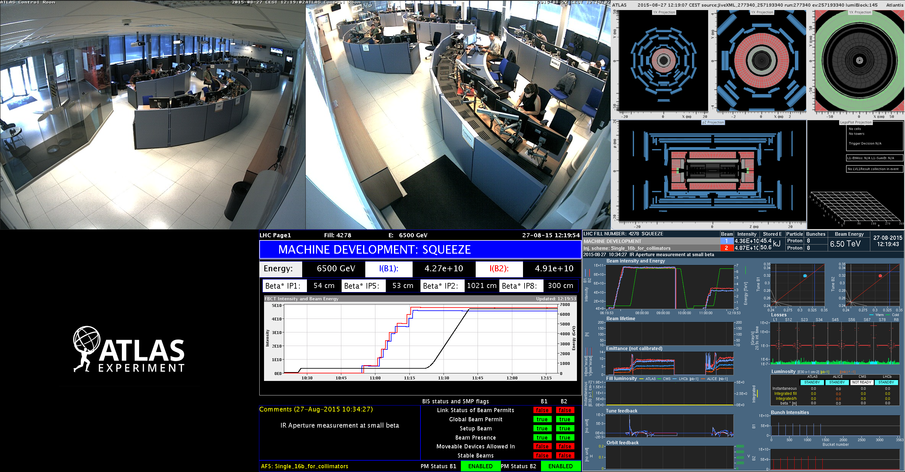

# CERN-views

utilities for viewing CERN information




# quick start

```Bash
sudo pip install selenium
sudo pip install moviepy
sudo pip install shijian
git clone https://github.com/wdbm/CERN-views.git
cd CERN-views

./record_ACR_OPV_auto-SSO.py
./process_raw_to_tiles_ACR_OPV.py # or process_raw_to_tiles_ACR_OPV_2.py
./process_tiles_to_video_ACR_OPV_2.py
```

# ACR, OPV recording

## checklist

A possible checklist before recording is as follows:

- Set the username and the passcode appropriately.
- Set the time duration of the recording. The default recording time is 1 week.

|**time**|**time in seconds**|
|--------|-------------------|
|8 hours |28800              |
|10 hours|36000              |
|1 day   |86400              |
|2 days  |172800             |
|3 days  |259200             |
|4 days  |345600             |
|1 week  |604800             |
|1 month |2629740            |
|1 year  |31556900           |

# OPVV-1

- OP Vistars multiplex view: <http://htmlpreview.github.io/?https://raw.githubusercontent.com/wdbm/CERN-views/master/OPVV-1.html>

# ATLAS-1

- LHC status, ATLAS status, ATLAS event display multiplex view: <http://htmlpreview.github.io/?https://raw.githubusercontent.com/wdbm/CERN-views/master/ATLAS-1.html>

# setup and run on LXPLUS glasvr02 2016-03-28T1628Z (experimental)

```Bash
ssh "${USER}"@lxplus7.cern.ch
ssh glasvr02

## Set up Python.
#mkdir /data/"${USER}"/Python
#cd /data/"${USER}"/Python
#wget --no-check-certificate https://www.python.org/ftp/python/2.7.6/Python-2.7.6.tar.xz
#tar xf Python-2.7.6.tar.xz
#cd Python-2.7.6
#./configure
#make
#alias python=/data/"${USER}"/Python/Python-2.7.6/python

# Set up Python.
mkdir /data/"${USER}"/Python
cd /data/"${USER}"/Python
wget --no-check-certificate https://www.python.org/ftp/python/3.5.1/Python-3.5.1.tar.xz
tar xf Python-3.5.1.tar.xz
cd Python-3.5.1
./configure
make
alias python=/data/"${USER}"/Python/Python-3.5.1/python

mkdir -p /data/wbm/CERN-views_environment
cd /data/wbm/CERN-views_environment

#setupATLAS
#source /cvmfs/atlas.cern.ch/repo/ATLASLocalRootBase/user/atlasLocalSetup.sh

echo "create Python virtual environment"
virtual_environment_name="virtual_environment"
virtualenv "${virtual_environment_name}"

echo "make activation dynamic"
activate_filename="virtual_environment/bin/activate"
temporary_filename="/tmp/"$(date "+%Y-%m-%dT%H%MZ" --utc)"" #"$(tempfile)"
cat > "${temporary_filename}" << "EOF"
directory_bin="$(cd "$(dirname "${BASH_SOURCE[0]}")" && pwd)"
directory_env="$(dirname "${directory_bin}")"
VIRTUAL_ENV="${directory_env}"
EOF
sed -i "/^VIRTUAL_ENV.*/ {
   r ${temporary_filename}
   d
}" "${activate_filename}"
rm "${temporary_filename}"

echo "activate Python virtual environment"
source "${virtual_environment_name}"/bin/activate

#IFS= read -d '' text << "EOF"
#import sys
#reload(sys)
#sys.setdefaultencoding("utf8")
#EOF
#echo "${text}" > "${virtual_environment_name}"/lib/python2.7/site-packages/sitecustomize.py

echo "install software in Python virtual environment"
pip install selenium
pip install moviepy
pip install shijian

echo "make Python virtual environment relocatable"
virtualenv --relocatable virtual_environment

git clone https://github.com/wdbm/CERN-views.git

vncserver
```

```Bash
vncviewer -via "${USER}"@glasvr02.cern.ch :1

cd /data/wbm/CERN-views_environment
virtual_environment_name="virtual_environment"
echo "activate Python virtual environment"
source "${virtual_environment_name}"/bin/activate
cd CERN-views
./record_ACR_OPV_auto-SSO.py
```
